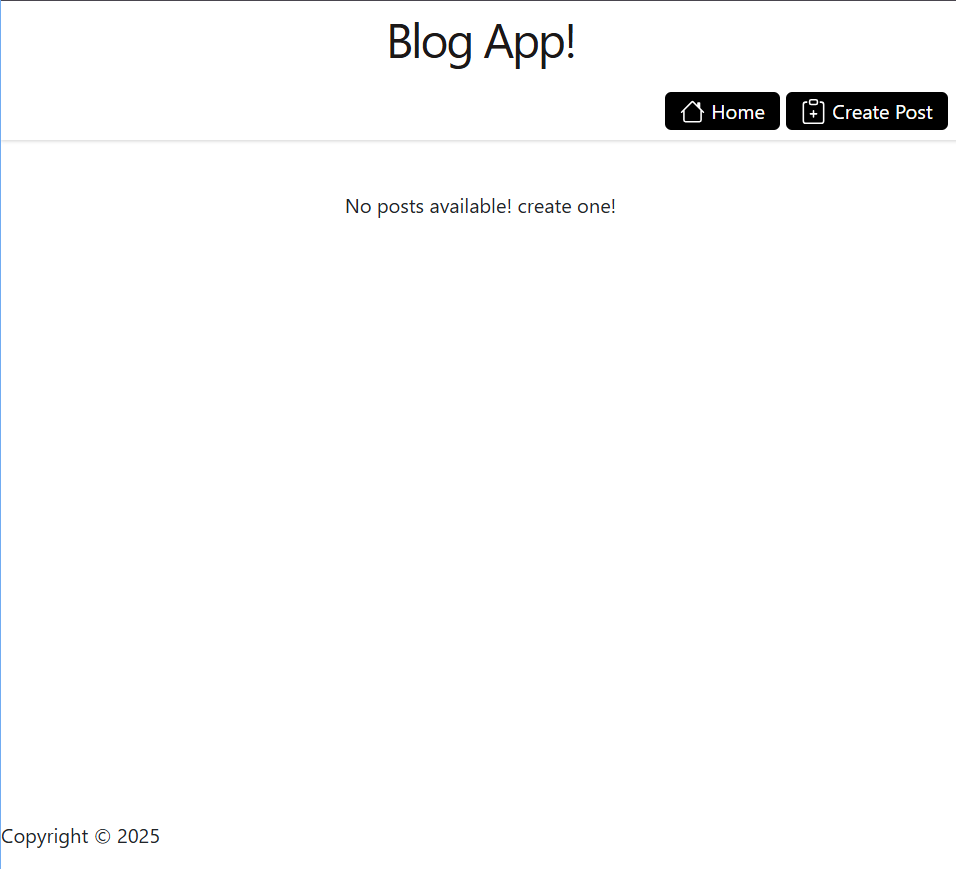
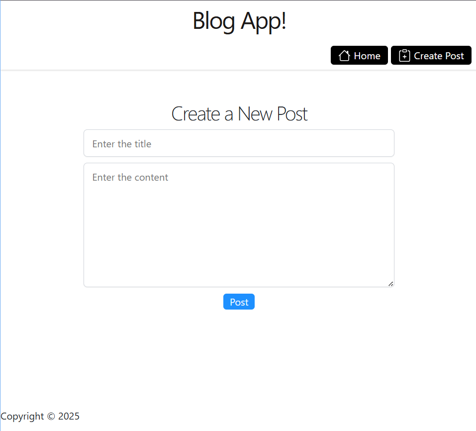
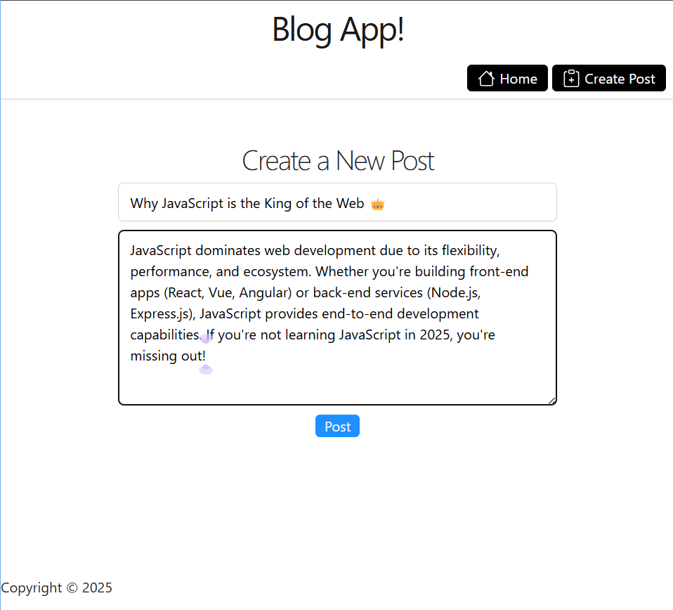
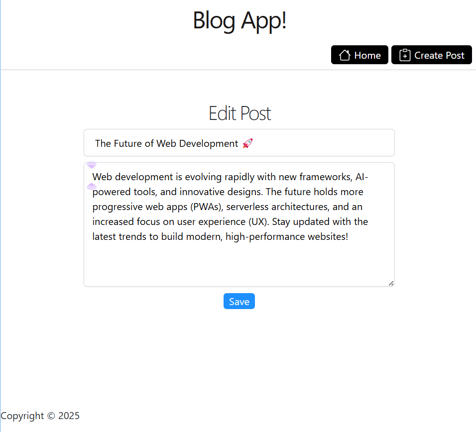
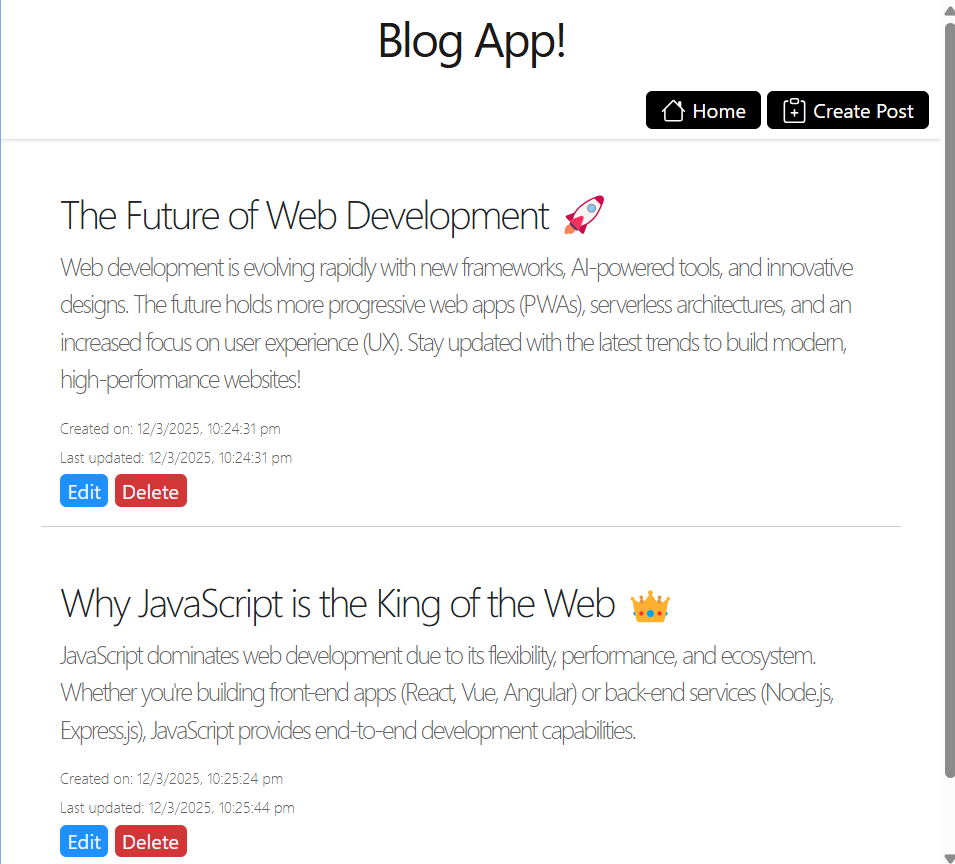

# Blogging App 

A simple blogging application built using **Node.js, Express, and EJS**, allowing users to create, edit, and delete blog posts.

## Features
- 📝 **Create Blogs** – Users can write and publish blogs.
- ✏️ **Edit Blogs** – Modify existing blog posts.
- ❌ **Delete Blogs** – Remove unwanted posts.
- 📅 **Timestamps** – Each post shows the **creation and last updated date**.
- 📜 **Dynamic Content Rendering** – Uses EJS for rendering blog posts dynamically.

## Technologies Used
- **Node.js** – Backend runtime.
- **Express.js** – Framework for handling routes and server logic.
- **EJS** – Templating engine for rendering dynamic pages.
- **JavaScript** – Frontend interactions.
- **CSS** – Styling and responsiveness.

## User Interface

## Deployed At [Blog App](https://express-blog-app-xmgq.onrender.com/)